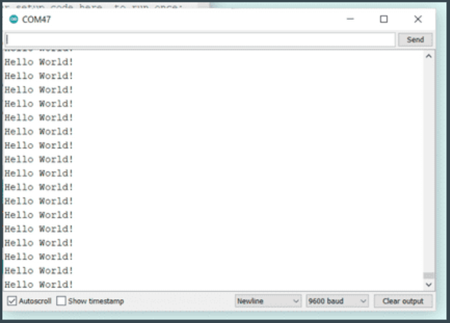
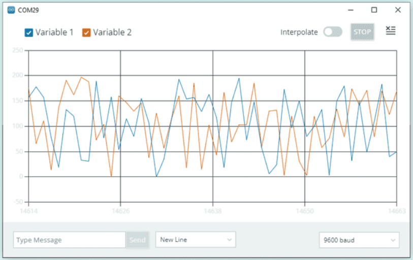

# Programming Notes for C++ and Arduino

Author: __*yufanana*__
____

## Table of Contents <a name="top"></a>
 1. [Modules Used in Each Set](#1)<br>
 2. [General Notes for C++](#2)<br>
    2.1 [If Statements](#2.1) <br>
3.  [General Notes for Arduino](#3)<br>
    3.1 [Serial Monitor/Plotter](#3.1) <br>
    3.2 [Add Libraries](#3.1) <br>
4. [EPD Shield](#4)<br>

## 1. Modules Used in Each Set <a name="1"></a>
[Go to top](#top)

Set 1: chainableRGB, push button, grove buzzer, switch <br>

Set 2: servo, LED, rotary angle sensor <br>

Set 3: servo, LED socket kit, line finder, water sensor <br>

Set 4: servo, LED socket kit, thumb joystick <br>

Set 5: servo, tilt sensor, vibration sensor, magnetic switch <br>

Set 6: servo, LED socket kit, light sensor <br>


## 2. General Notes for C++ <a name="2"></a>
[Go to top](#top)

- Semicolon `;` at the end of the line
- Variables: declare data type
    - `int myNumber`
    - `float x`
- Functions: declare return type
    - `void myFunction(){}`
    - `void getSum(int a, int b){return a+b;}`
- Add `{}` curly brackets for if/while/for loops
- `//` for commenting
- A `const` variable cannot be changed later in the program
    - `const int myVariable`
- `#define` will replace all instances with the specified value at compile time
    - `#define sensorPin 4`


### 2.1 If Statements <a name="2.1"></a>
[Go to top](#top)

```c++
if(condition == 1){
    // do something
}
else if(condition == 2){
    // do something
} 
else{
    // do something
}
```

AND `&&` 

OR `||` 

Inequalities `>, >=, <, <=, !=, ==` 

C++ uses __short-circuit boolean__ evaluation.

`bool1 && bool2` If bool1 is false, it will not evaluate bool2.

`bool1 || bool2` If bool1 is true, it will not evaluate bool2.

Use `&` and `|` to evaluate all expressiosn.

## 3. General Notes for Arduino <a name="3"></a>
[Go to top](#top)


- `pinMode(pin, mode)`
    - pin: an number for digital pins, A0/A1/A2 for analog pins
    - mode: INPUT, OUTPUT
- `analogRead(pin)`, `digitalRead(pin)`
    - to read the pin value
- `analogWrite(pin, value)`, `digitalWrite(pin, value)`
    - to write/set the pin value
    - only pins 3,5,6,9,10,11 can send PWM wave
- `delay(ms)`
    - pause the program for the specified duration in milliseconds
- `Serial.print(“My name is: ”)`
    - prints to the serial monitor
- `Serial.println(“John”)`
    - prints new line at the end

Upload empty program to stop the program. <br>

__Wiring__<br>
Red &rarr; 5V / VCC <br> 
Brown &rarr; GND / Ground <br> 
Yellow &rarr; Signal <br> 

### 3.1 Serial Monitor/Plotter<a name="3.1"></a>
[Go to top](#top)

In the Arduino IDE, go to *Tools > Serial Monitor/Plotter*

Serial Monitor <br>


Serial Plotter <br>


### 3.2 Add Libraries <a name="3.1"></a>
[Go to top](#top)

- Download the .ZIP file from GitHub <br>
- Sketch > Include Library > Add .ZIP Library ... > Select downloaded .ZIP file


### 4 EPD Shield <a name="4"></a>
[Go to top](#top)

- Potentiometer / Rotary Encoder (A0)
- 2 LEDs (D7 and D8)
- 2 buttons (D1 and D2)
